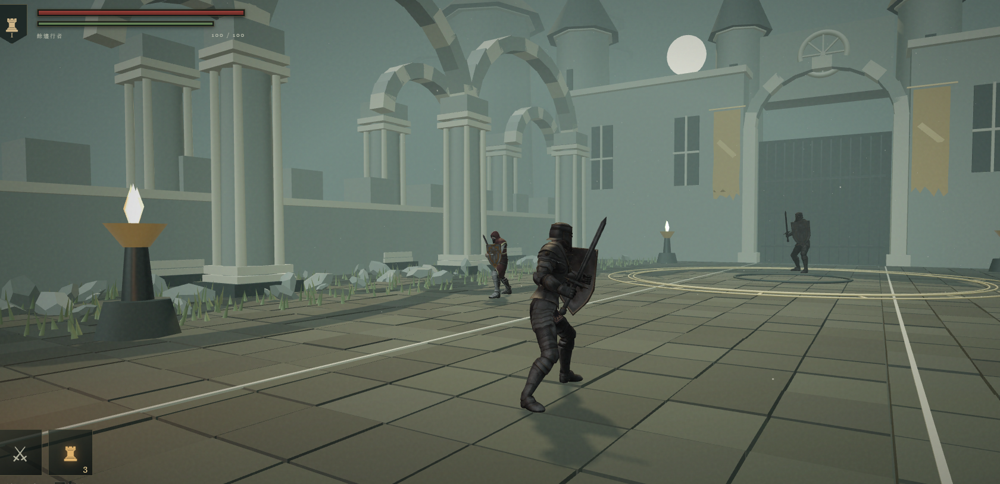

# 灰燼之庭 · ASHFALL

原創 3D 第三人稱魂系戰鬥原型。使用 Three.js。場景、介面與音效為專案自製，角色與動畫來自 Adobe Mixamo（見 `CREDITS.md`），沒有使用《黑暗靈魂》的素材。

**線上試玩：** https://soulslike-96jd.onrender.com/



## 啟動

Windows 雙擊 **start-game.cmd**，保留啟動的命令列視窗；若瀏覽器先開啟而顯示無法連線，稍等一秒後重新整理。

也可在此資料夾執行：

```sh
npm install --ignore-scripts
npm start
```

開啟 http://127.0.0.1:4173。需要 Node.js，以及支援 WebGL 2 的桌面 Chrome / Edge。套件安裝完成後，遊戲不需網路連線。不要直接雙擊 index.html，ES 模組需要本機伺服器。

## 操作

| 操作 | 按鍵 |
| --- | --- |
| 移動 | WASD |
| 視角 | 滑鼠；方向鍵左右亦可旋轉 |
| 調整鏡頭距離 | 滑鼠滾輪 |
| 輕攻擊 | 滑鼠左鍵 / J |
| 重攻擊 | R |
| 持盾防禦 | 按住滑鼠右鍵 / K |
| 翻滾 | Space，搭配方向鍵 WASD |
| 奔跑 | 按住 Shift |
| 鎖定 / 解除 | Q |
| 補血 | F |
| 篝火休息 / 拾回餘燼 | E |
| 暫停 | Esc |
| 操作說明 | H |
| 音效開關 | M |

## 本版內容

- 可探索的廢棄庭院、教堂立面、石柱碰撞、環繞鏡頭、篝火、灰燼粒子與動態陰影。
- 劍盾角色、攻擊前搖與後搖、翻滾無敵時間、正面格擋、體力恢復與防禦崩潰。
- 兩名守衛與「灰庭守誓者」頭目。頭目半血後加速並使用二連擊。
- 三次餘火瓶補給；篝火回復生命與補給、重置普通敵人。
- 死亡掉落餘燼、篝火重生及掉落物回收。再次死亡會取代先前掉落。
- 擊敗頭目可繼續探索或重新挑戰；暫停、操作指南與合成音效。

這是單一關卡的可玩原型，約 5–10 分鐘，場景使用幾何造型美術。尚未包含完整 RPG、裝備成長、存檔、手把或手機操作。

## 程式結構與檢查

- `src/game.js`：與渲染分離的戰鬥及重生邏輯。
- `src/world.js`：Three.js 場景、角色動畫及鏡頭。
- `src/main.js`：輸入、HUD、介面與音效。
- `server.mjs`：僅監聽本機的靜態伺服器。

```sh
npm run check
npm test
```

Three.js 採 MIT 授權，授權內容見 `node_modules/three/LICENSE`。

## v0.3 更新

玩家、頭目與守衛改用匯入的貼圖蒙皮模型與骨骼動畫，取代先前的幾何造型角色。共 13 段動作剪輯（待機、行走、奔跑、前後左右移動、輕攻擊、重攻擊、格擋、翻滾、受擊、補血、死亡），由 `tools/build-character-clips.mjs` 從 FBX 重新產生為 `assets/characters/*-clips.json`。

角色與動畫素材來自 Adobe Mixamo，授權與來源說明見 `CREDITS.md`。場景、介面、玩法與合成音效仍為專案自製。

## 部署到 Render

本專案是純靜態網站，可用 Render Static Site 免費部署。`render.yaml` 已包含設定：

- Build Command：`npm install --ignore-scripts --no-audit --no-fund`
- Publish Directory：`.`

在 Render 選「New → Blueprint」連上這個 GitHub repo 即可自動建立服務。
